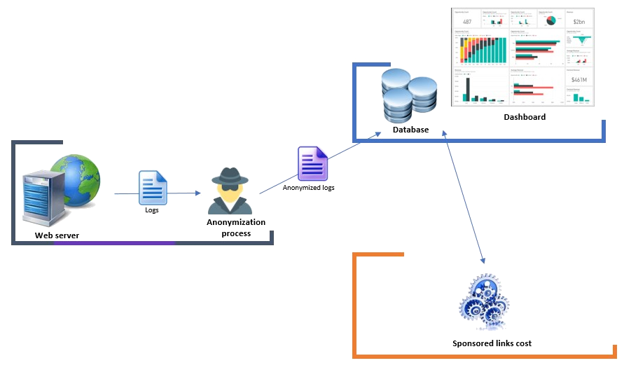
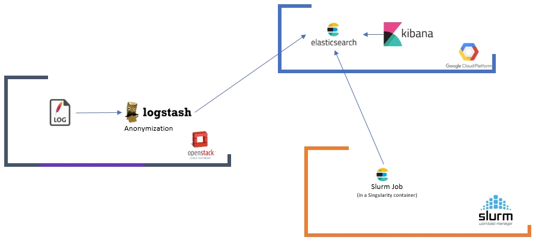

# Samples

This directory contains components and topologies templates that are used for demo and education purpose.

## The Hybrid Demo

This demo is used to demonstrate the hybrid deployments capabilities of Yorc and Alien4Cloud.

It is a fictional scenario that allows to implies 3 different infrastructures.

Lets imagine we are working for a big company that operate a web site. This website generates logs on
acceded web pages. Those logs contains, among others, a referral field that will be used to see from
where visitors are coming into this web site. We consider that this server is hosted on premise in a
private cloud.

For convenience we want to have a world-wide accessible database that will allow our remote teams to
access data extracted from those logs. This database and associated visualization dashboard will be
hosted on a public cloud.

Logs are anonymized on premise before being shipped to the database.

Finally we want make in place a sponsorship system and retribute referrals for promoting our web site
to their visitors. We will have a job that will compute retributions based on data contained in the
database. As we are in purely fictional example lets say that this computation requires so many computing
power that it need to be done on an HPC cluster scheduled by Slurm.

The bellow figure summarize this:

### Component level architecture

Here is a detailed description of components used to implement this scenario.

The visualization part of the application is composed by an ElasticSearch Database for indexing logs and
a Kibana visualization system with dedicated dashboards (one for general web site data and another for referrals
retributions). We deploy this part on GCP.

The logs generation and anonymization process is done by a random log generator, then shipped to Logstash using
FileBeat. Logstash filters will remove all personal data like IP addresses from log and then will ship them to
ElasticSearch

Finally the referral retribution computation job is implemented by a Slurm Job executed within a Singularity
container.

### Let set it up

1. Setup an Alien4Cloud that could access the 3 infrastructures
2. Deploy Yorc on those infrastructures
3. Setup 3 orchestrators in a4c
4. Create an app using the `org.ystia.samples.topologies.ApacheGeneratorVisu` topology
5. Select GCP as location and make sure the compute you deploy on as the correct network tags to expose both 9200 and 5601 ports (on our demo infra it is the `hybrid-demo` tag)
6. On `Review & Deploy` in the `Service Management` tab click on `Expose this deployment as a service `.
7. Deploy this app
8. Go to `Administration > Services  > Your Service` on the `Location(s)` tab and authorize it on the 3 locations
9. When deployed go to `Kibana > management > Index Patterns > logstash-*` and make it the default index by clicking on the star button
10. Deploy ̀org.ystia.samples.topologies.ApacheGeneratorAnonymization` topology on OpenStack if needed you should configure a proxy in inputs to allow logstash to connect to ES.
11. After deploying this you should start seeing some data in Kibana `Website analytics` dashboard
12. Deploy `org.ystia.samples.topologies.ApacheLogsRefComputeJob` topology on Slurm. Then launch the run workflow.
13. In Kibana the `Click cost per domain` dashboard should now be populated.
14. You can repeat the 2 previous steps to update those data
