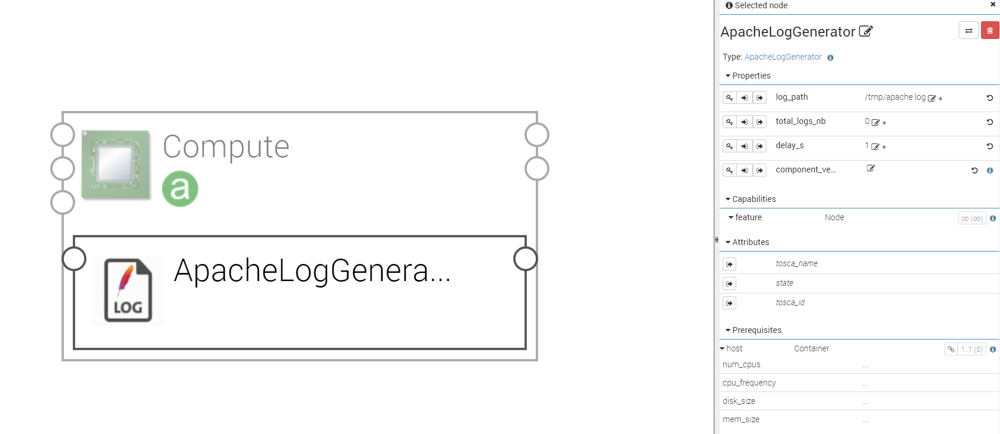

**************************************
Apache log generator sample components
**************************************

.. contents::
    :local:
    :depth: 3

This component has been created in order to demonstrate our capacity of deploying hybrid topology.
It generates fake Apache log to simulate the use of such Web server (from https://github.com/kiritbasu/Fake-Apache-Log-Generator).

ApacheLogGenerator
------------------

Generated periodically log data to a log file. It can be configured using the properties below:

Properties
^^^^^^^^^^

- **log_path**: Log file path

- **total_logs_nb**: The number of generated log messages (0 for infinite)

- **delay_s**: generation frequency

Requirements
^^^^^^^^^^^^

- **host**: ApacheLogGenerator component has to be hosted on a Compute.

ApacheLogDashboard
------------------
The Kibana dashboard is provided in order to show some interesting analysis of the web server performances.
