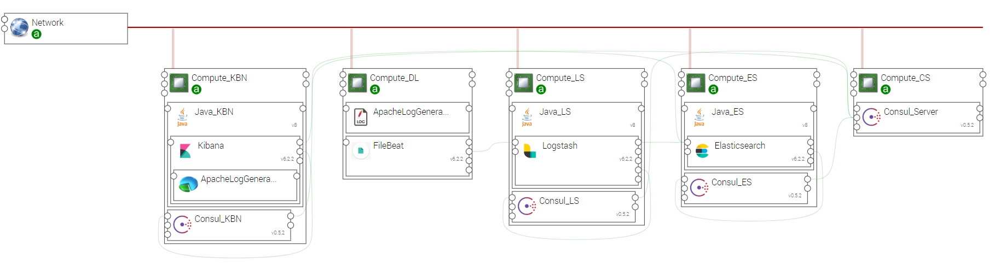

.. _elk_apache_generator_section:

********************
ELK_APACHE_GENERATOR
********************

This topology templates is another example that can be can be used to test an ELK chain with some Webserver generated log data.

.. contents::
    :local:
    :depth: 3

Import Components and Topology template
----------------------------------------

  This step may be skipped in case you use Alien4Cloud's git integration for CSARs management

Upload the following Ystia components' CSARs to the Alien4Cloud catalog, and respect the order in the list:

#. **common**
#. **consul**
#. **java**
#. **kafka**
#. **elasticsearch**
#. **logstash**
#. **kibana**
#. **apache-log-generator**

Upload the **elk_apache_log_generator** topology archive to the Alien4Cloud Topology template catalog.

Topology template
-----------------
The **elk_apache_log_generator** template provides the following configuration:

- Relationships between the ELK components are created.

- ELK components are designed to be deployed on Compute hosts and appropriate Java distribution.

- Consul allows Elasticsearch cluster discovery.

- A compute hosting the ApacheLogGenerator component and a FileBeat component, both pre-configured to share the logs file. A relationship is created between FileBeat and Logstash.

- The Kibana node is hosting the DummyLogsDashboard

Create an application
---------------------
The application can be created via the Alien4Cloud GUI using the **elk_apache_log_generator** topology shown below:

Complete configuration
----------------------

- Waiting for a bug resolution in Alien4Cloud, you will need to upload a **Logstash** configuration file using **filter_conf** artifact. Use the config/logstash-apache-generator-filters.conf file.

Deploy application and when the application is running, connect to Kibana using the **url** output attribute, then open the **Website analytics** dashboard.